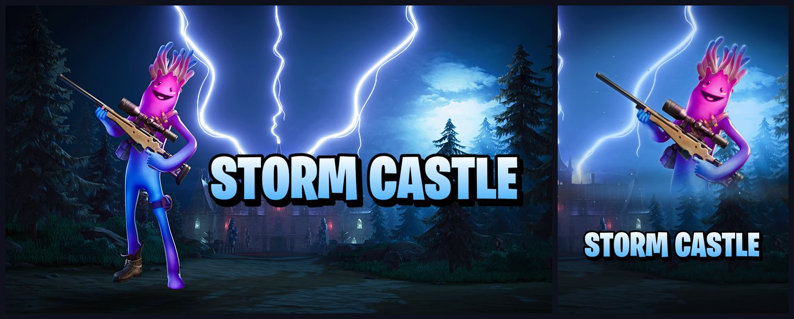
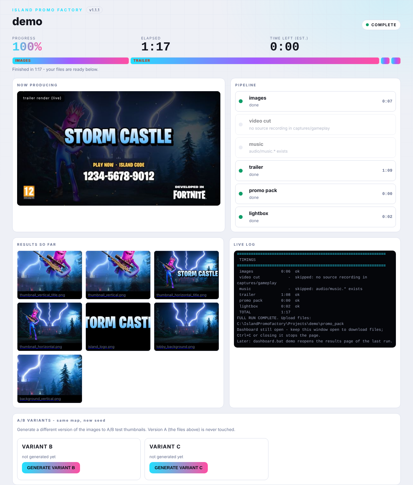
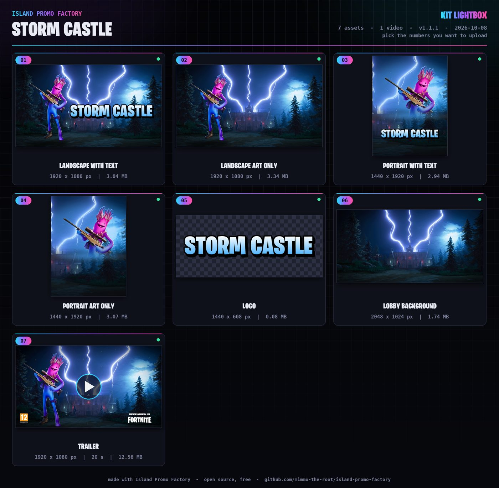

# Island Promo Factory

**Everything the Fortnite Creator Portal asks for your UEFN island — thumbnails, logo, gameplay video, trailer, screenshots — built on your own PC, one map at a time.**

You give it an environment screenshot, a character render and a gameplay recording. It gives you the files the portal asks for,
already at the right size, inside the safe areas, validated and named like the portal fields.


<sup>Example map "STORM CASTLE", built in UEFN. Fortnite and Unreal Editor for Fortnite are trademarks of Epic Games, Inc.; Island Promo Factory is an unofficial tool.</sup>

| Output | Spec |
|---|---|
| Landscape thumbnail (with title / art only) | 1920x1080 PNG, < 5 MB |
| Portrait thumbnail (with title / art only) | 1440x1920 PNG, < 5 MB |
| Island logo | 1440x608 transparent PNG |
| Lobby background | 2048x1024 PNG |
| Gameplay video | 1920x1080 MP4, 10-40 s, cinematic montage of your own recording with generated music |
| Trailer | 1920x1080 MP4, 10-40 s, your real clips, end card, PEGI + "Developed in Fortnite" badges |
| Screenshots (3) | 1920x1080 PNG, graded like the videos |

> Specs reflect the Creator Portal in October 2026. Epic changes them: always check the portal. Details: [docs/SPECS.md](docs/SPECS.md).

## Choose your setup

**ComfyUI and the AI models are NOT included** in this repository and are the only big download (about 30 GB). They are used for one thing:
the AI-generated horizontal artwork. Everything else (title, logo, vertical art, thumbnails, gameplay, trailer, screenshots, music, promo pack) runs without them.

| Setup | You need | You get | You miss |
|---|---|---|---|
| **Full** | Windows, NVIDIA GPU with about 12 GB VRAM, ~40 GB disk, ComfyUI + 3 models | everything, including AI horizontal art and A/B variants | nothing |
| **Light** | Windows, any PC, Python, ffmpeg | everything below the AI art; the vertical art is built without AI and you supply the horizontal art | AI horizontal art |
| **Remote ComfyUI** | Light + a ComfyUI running on another PC or in the cloud (`COMFY_URL`) | the Full result on a weak PC | nothing |

Step-by-step install for all three: **[docs/INSTALL.md](docs/INSTALL.md)**. Run `doctor.bat` (or `doctor.bat --profile light`) at any time: it tells you what is ready and the exact fix for what is not.

## Two ways to use it

**With Claude Code (recommended).** Open the `island-promo-factory` folder in Claude Code and type `/promo-pack`. Claude asks for the island code, title and your files,
starts ComfyUI and the live console for you, runs every step, checks the results and writes a report. You never have to double-click a `.bat` file.
See [Using it with Claude Code](#using-it-with-claude-code).

**Without Claude.** Everything also runs from plain commands:

```bat
doctor.bat                                   :: what is ready, what is missing
demo.bat                                     :: a complete demo kit in about two minutes, no GPU needed
new_map.bat my-map "MY MAP TITLE" --style SCI_FI
:: put your files in Projects\my-map\
::   background\background.png     the environment, no characters, >= 1920 px wide
::   characters\character_01.png   ONE character, transparent PNG with margin on all sides
::   captures\gameplay\recording.mp4   a 5+ minute recording of your island (optional but recommended)
:: edit Projects\my-map\config.json  (island_code, title, style, character identity)
run_all.bat my-map --review-prompt           :: add --no-qwen if you have no ComfyUI
dashboard.bat my-map                         :: reopen the live results page (runs in the background)
```

Results: `Projects\my-map\promo_pack\` (portal-ready, numbered like the portal fields) and `Projects\my-map\final\`.

## The live console

A web page on your own PC (never exposed to the network) follows the run: progress, time left, what is being produced right now, the results as they appear, the log,
and buttons to generate **variants B and C** of the artwork with a different seed for A/B tests.



When the run is done, the promo pack and its numbered preview board (the "Kit Lightbox") are one click away:



## How it works

```
 environment.png + character.png + recording.mp4
        |
        v
  [Qwen Image Edit via ComfyUI]  -> horizontal art (one character, no text)   (Full / Remote)
  [deterministic composite]      -> vertical half-body art (no AI, full control)
        |
        v
  title + logo (your font)  ->  thumbnails  ->  validator  ->  promo_pack/
        |
        v
  gameplay montage + trailer + screenshots (ffmpeg, one cinematic look, generated music)
```

- **AI makes art only.** Titles and logos are rendered with a real font, so text is always crisp and correct. A quality gate rejects invented text, extra objects and creatures.
- **Every stage is checked.** A stage must exit 0 *and* create its file, otherwise the run stops with a clear message.
- **Nothing is deleted.** Old results move to `_previous` or `_to_delete_*` folders.
- **One map at a time.** Review, upload, learn, then the next map.
- **Gameplay scenes:** the gameplay video is 2-3 real scenes from your best moments with generated music instead of the original audio (`--gameplay-scenes 2|3`, default 3).
- **Look:** `--gameplay-look cinematic|hype|off` applies one look to the gameplay video, the trailer clips and the screenshots. `off` keeps your footage unedited.
- **Music:** original tracks are generated by the kit (no third-party material). Your own `audio/music.mp3` always wins.

## Your brand, your files (not included)

- **Font:** drop a `.otf`/`.ttf` in `Resources/brand/font/`. Without one, an open-licensed fallback font is used. Fortnite's Burbank is *not* distributed here.
- **Badges:** `Resources/badges/pegi.png` and `developed_in_fortnite.png` (video only, never distorted). Get the official files from their owners.
- **Music:** optional `Projects/<map>/audio/music.mp3`. Use only music you are licensed to use.
- **Gameplay and screenshots** come from *your* recording. The default look edits them (grade, speed, transitions); the portal may ask for real, unedited gameplay: use `--gameplay-look off` for an unedited cut and check Epic's current rules before uploading.

## Using it with Claude Code

`CLAUDE.md` and the skills in `.claude/skills/` describe the commands, folders and rules, so Claude can run the whole loop:
`island-intake` (step 0: island code, title, assets, READY check), `island-images`, `island-video`, `island-review`, orchestrated by `island-promo`.
Commands: `/promo-pack` (create or continue the promo package of an island), `/promo-conform` (start from a thumbnail you already have), `/promo-console` (open the live console), `/promo-update` (install the newest release).
At every session start the kit syncs its skills and tells you when a newer release exists. Details: [docs/USAGE.md](docs/USAGE.md), [docs/UPDATING.md](docs/UPDATING.md).

## Tuning

Environment variables (see [docs/USAGE.md](docs/USAGE.md)): `PROMO_PROJECT`, `PROMO_SEED`, `PROMO_DEBUG=1`, `PROMO_PROFILE=light`, `COMFY_URL`,
`PROMO_TITLE_CX`, `PROMO_VTITLE_W`, `PROMO_VTITLE_CY`, `PROMO_BUST_CROP`, `PROMO_BUST_H`, `PROMO_BUST_TOP`, `PROMO_CHAR_X`, `PROMO_TRAILER_SECONDS`, `PROMO_BADGE_MODE`.

## Tests

`python tests/smoke_test.py` builds a synthetic map end-to-end with a mock ComfyUI server: no GPU, no game assets.

## Limits you should know

- Qwen does not obey numeric positions, so the vertical art is composed by script, not by the model.
- A clipped character render shows hard edges (they are feathered, but give it margin).
- The gameplay montage and the trailer are edited footage of your own recording; they are not AI video.
- Unofficial tool, not affiliated with Epic Games. See [DISCLAIMER.md](DISCLAIMER.md) and [NOTICE.md](NOTICE.md). Security: [SECURITY.md](.github/SECURITY.md).

## Versions and updates

The console shows the installed version and tells you when a newer release exists; `update.bat` (or `/promo-update` in Claude Code) installs it without touching your maps or brand files.
See [docs/UPDATING.md](docs/UPDATING.md) and [CHANGELOG.md](CHANGELOG.md).

## License

MIT for the code (see [LICENSE](LICENSE)). Models, fonts, badges and game content have their own licences.
